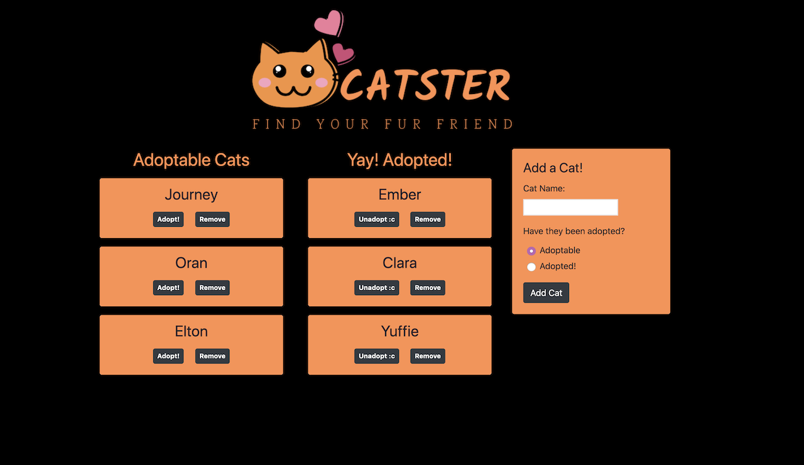

# adopted
Browser app created to log rescue cats up for adoption and easily move them from adoptable to adopted. Will be integrated into the cat finder app Catster.

[Link to page](https://infinite-sea-58853.herokuapp.com/)

## Description
This app follows the MVC design pattern. Using MySQL, Node, Express, Handlebars and an ORM; this app will allow a user to move cats from adoptable to adopted as well as add new cats.

## How to Use
Click the button next to the cat's name to move it to adopted. Use the form on the page to add a new cat and indicate if it is adoptable or had been adopted. 

## Tech Used

- HTML
- Visual Studios
- JavaScript
- Node.js
- Express
- MySQL
- Handlebars

## Role in App Development
Created by one developer